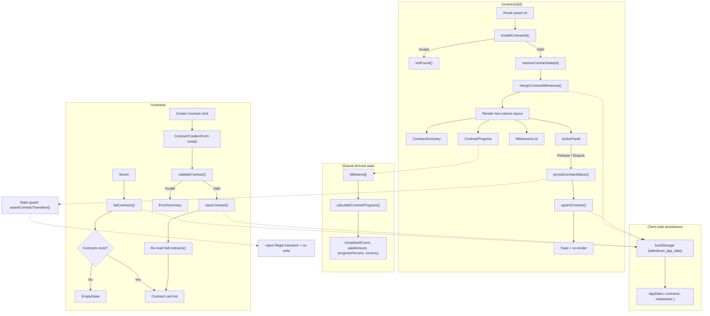

# Contracts Data-Flow Diagram

The goal of this document is to help new contributors understand how contracts data is fetched, transformed, and rendered without needing to trace through multiple components and hooks in the codebase.

## Flow Notes

### Contracts List (/contracts)

- Fetch: `listContracts()` (from `src/lib/repository.ts`) reads `talenttrust_app_data` from `localStorage`. SSR-safe — returns an empty array when `window` is undefined or the store is corrupt.
- Render: Shows `EmptyState` when the list is empty, otherwise renders a card list with contract name, status, and creation date.
- Create: The `ContractCreationForm` modal accepts user input, runs `validateContract()` (pure validation, from `src/lib/validateContract.ts`) for field errors, then calls `saveContract()` to persist. The list is refreshed by re-invoking `listContracts()`.

A secondary inline form (`CreateContractForm`, in `src/components/contracts/`) follows the same validation and persistence pattern but renders in-page instead of in a modal.

### Contract Detail (/contracts/[id])

- Route validation: `isValidContractId(id)` (from `src/lib/validateContractId.ts`) guards the route — rejects empty, oversized, or special-character IDs by calling Next.js `notFound()`.
- Fetch: Two sources — `resolveContractData(id)` (async, from `src/lib/contractResolver.ts`, a typed mock that returns `ContractData`) and `listMilestonesByContract(id)` (sync, from the repository).
- Transform: `mergeContractMilestones()` de-duplicates by milestone `id`, with persisted records taking precedence over resolver records. `buildPersistedContract()` narrows `ContractData` into the repository `Contract` shape for status writes.
- Render: Left column — `ContractSummary` (metadata, parties), `ContractProgress` (escrow bar + fund cards), `MilestonesList` (scrollable roster). Right column — `ActionPanel` (context-aware buttons). Each component is wrapped in `SafeBoundary` for render-error isolation. Skeleton placeholders display during loading.
- State updates: `persistContractStatus()` writes status transitions (Complete/Dispute) to the repository via `upsertContract()`, updates local state optimistically, and surfaces a toast. `ContractStatusAnnouncer` (with `aria-live`) announces transitions to screen readers.

### State Invariants

The contract detail route owns a small, explicit state machine. The invariants below are enforced in code and covered by focused tests.

- **Allowed transitions**: `Pending -> Active`, `Active -> Complete`, `Active -> Disputed. Any other transition (e.g. `Complete -> Disputed`, `Disputed -> Complete`, `Complete -> Complete`) must be rejected.
- *(Terminal states**: `Complete` and `Disputed` are terminal. Once entered, no further transition is permitted.
- **Atomicity**: A rejected transition must not write to the repository and must not mutate local state. The guard check runs before any persistence or optimistic update.
- **Concurrency**: Repeated or concurrent invocations of the same transition are idempotent — the second invocation is a no-op rather than a duplicate write or an error.
- **Data integrity**: The persisted contract record must retain its `id`, `milestoneCount`, and ownership fields across every transition. Only the `status` field is allowed to change.
- **Authorization**: Only the contract's authorized parties may initiate Release or Dispute. Unauthorized attempts fail closed with a user-visible error and are logged without exposing sensitive fields.

### Loading Boundary (`src/app/contracts/[id]/loading.tsx`)

The route-level `loading.tsx` suspense fallback is a pure presentational component with no data dependencies. To keep it deterministic and reviewable, it defines explicit validation boundaries for the contract `id` it is rendering for:

- **Accepted input**: `id` is a non-empty string that passes `isValidContractId(id)`. The fallback renders the same skeleton layout as the loaded page (summary, progress, and milestone placeholders) with `aria-busy="true"` and `aria-live="polite"`.
- **Invalid input**: When `id` is missing, empty, oversized, or contains disallowed characters, the fallback does not attempt to resolve or render contract data. It renders a neutral container with a single `aria-live="polite"` status message so the user is told the route is unavailable without exposing the raw `id`.
- **Duplicate input**: The fallback is idempotent. Re-rendering with the same `id` produces the same markup and the same accessibility announcement; no data is fetched, no state is written, and no consecutive renders can change the outcome.
- **Boundary values**: The validation boundaries match `isValidContractId()` exactly (maximum length and allowed character set), so the loading fallback and the page itself agree on which IDs are acceptable. This avoids a flash of loading UI for an ID that will immediately resolve to `notFound()`.

The fallback never reads from `localStorage`, never calls `resolveContractData()`, and never writes to the repository, so it cannot introduce concurrency, retry, or partial-failure hazards.

### Shared Derived State

- `useContractProgress(milestones)` wraps `calculateContractProgress()`, deriving `completedCount`, `totalCount`, `paidAmount`, `outstandingAmount`, `progressPercent`, and `currency` from the milestone array. Memoized and shared across `ContractProgress` and any consumer that needs escrow math.

### Persistence Layer

All read/write operations flow through `src/lib/repository.ts`, which serializes the full app state under the single `localStorage` key `talenttrust_app_data`. The layer is synchronous, SSR-safe, and non-mutating (callers own their data). See `docs/data-model.md` for the full API reference.

## Validation Boundaries

This section defines the accepted, rejected, duplicate, and boundary-case input handling for `src/app/contracts/page.tsx`. The boundaries are enforced at the edge of the page and in the pure validation modules so that the same rules apply to the modal form, the inline form, and any future caller.

#### Invariants

1. All contract inputs are normalized (trimmed, collapsed whitespace) before validation. Validation runs on the normalized value and the normalized value is what gets persisted.
2. Validation is pure and deterministic: given the same input and the same existing contract set, `validateContract()` returns the same result.
3. A submission is rejected when the normalized contract name duplicates an existing contract case-insensitively. The duplicate check is explicit and surfaced as a field error.
4. Status transitions are guarded: only transitions allowed by the contract state machine are persisted. Invalid transitions are rejected with a user-visible message and no write occurs.
5. Concurrent submits are serialized: the form disables its submit button while a write is in flight and re-reads the list after the write completes. A second submit for the same normalized name is rejected by the duplicate check.
6. Persistence failures do not leave the UI in an optimistic but unpersisted state: on error, local state is reverted and a non-sensitive error message is shown.

#### Accepted input

- Non-empty `contractName` after normalization.
- `totalValue` a finite number greater than 0 and less than or equal to the configured maximum.
- `currency` in the allowed set (e.g. `USD`, `EUR`, `GBP`).
- `parties` with at least one non-empty client and one non-empty contractor.
- `createdAt` a valid ISO timestamp not in the future.

#### Rejected input

- Empty or whitespace-only contract name.
- Names exceeding the maximum length (default 120 characters).
- Non-finite or non-positive `totalValue`.
- $Values above the configured maximum (default 1,000,000,000).
- Unknown currency codes.
- $Missing or empty party names.
- $Invalid or future `createdAt`.

#### Duplicate submissions

- Two contracts with the same normalized name (case-insensitive) are not allowed; the second submission receives a field error and is not persisted.
- Rapid double-click on the submit button is ignored while the first write is in flight.
- Re-submitting after a successful create with the same name is rejected by the duplicate check because the list is re-read after the write.

#### Boundary values

| Field | Minimum | Maximum | Notes |
| --- | --- | --- | --- |
| `contractName` | 1 non-whitespace character | 120 characters | Normalized before checking. |
| `totalValue` | > 0 | 1,000,000,000 | Must be finite. |
| `currency` | — | — | Must be in the allowed set. |
| `createdAt` | — | now | Must parse as a valid date. |
| `parties` | 1 client + 1 contractor | — | Names normalized and non-empty. |

#### Observability

- Validation failures are reported through the form's `ErrorSummary` and field-level messages. Messages identify the field and the rule that failed without echoing the raw input.
- Persistence failures are logged with a stable code (e.g. `contracts.create.failed`) and surfaced as a toast. No sensitive field values are included in logs.
- Status transition rejections are announced via `ContractStatusAnnouncer` and recorded with the attempted transition and the current status.

## Key Data Types

| Type | Source | Fields |
| --- | --- | --- |
| `ContractData` | `src/lib/contractResolver.ts` | `id`, `name`, `status`, `parties`, `totalValue`, `currency`, `createdAt`, `milestones` |
| `Contract` | `src/types/domain.ts` | `contractName`, `parties`, `totalValue`, `currency`, `status`, `createdAt`, `milestoneCount` |
| `Milestone` | `src/components/MilestonesList.tsx` | `id`, `title`, `status`, `payout`, `currency`, `dueDate?`, `contractId?` |
| `ContractProgressMetrics` | `src/hooks/useContractProgress.ts` | `completedCount`, `totalCount`, `paidAmount`, `outstandingAmount`, `progressPercent`, `currency` |
